```python
import matplotlib.pyplot as plt
import numpy as np
import seaborn as sbn
import pandas as pd
from wordcloud import WordCloud, ImageColorGenerator

%matplotlib inline

plt.style.use('default') 

sbn.set(style="whitegrid") 

```


```python
trocafoneData = pd.read_csv('/home/javier/Datos/fiuba-trocafone-tp1-final-set/events.csv',low_memory = False)
```


```python
trocafoneData.head()
```


<div>
<style scoped>
    .dataframe tbody tr th:only-of-type {
        vertical-align: middle;
    }

    .dataframe tbody tr th {
        vertical-align: top;
    }

    .dataframe thead th {
        text-align: right;
    }
</style>
<table border="1" class="dataframe">
  <thead>
    <tr style="text-align: right;">
      <th></th>
      <th>timestamp</th>
      <th>event</th>
      <th>person</th>
      <th>url</th>
      <th>sku</th>
      <th>model</th>
      <th>condition</th>
      <th>storage</th>
      <th>color</th>
      <th>skus</th>
      <th>...</th>
      <th>search_engine</th>
      <th>channel</th>
      <th>new_vs_returning</th>
      <th>city</th>
      <th>region</th>
      <th>country</th>
      <th>device_type</th>
      <th>screen_resolution</th>
      <th>operating_system_version</th>
      <th>browser_version</th>
    </tr>
  </thead>
  <tbody>
    <tr>
      <th>0</th>
      <td>2018-05-31 23:38:05</td>
      <td>ad campaign hit</td>
      <td>0004b0a2</td>
      <td>/comprar/iphone/iphone-5s</td>
      <td>NaN</td>
      <td>NaN</td>
      <td>NaN</td>
      <td>NaN</td>
      <td>NaN</td>
      <td>NaN</td>
      <td>...</td>
      <td>NaN</td>
      <td>NaN</td>
      <td>NaN</td>
      <td>NaN</td>
      <td>NaN</td>
      <td>NaN</td>
      <td>NaN</td>
      <td>NaN</td>
      <td>NaN</td>
      <td>NaN</td>
    </tr>
    <tr>
      <th>1</th>
      <td>2018-05-31 23:38:05</td>
      <td>visited site</td>
      <td>0004b0a2</td>
      <td>NaN</td>
      <td>NaN</td>
      <td>NaN</td>
      <td>NaN</td>
      <td>NaN</td>
      <td>NaN</td>
      <td>NaN</td>
      <td>...</td>
      <td>NaN</td>
      <td>Paid</td>
      <td>New</td>
      <td>Camaragibe</td>
      <td>Pernambuco</td>
      <td>Brazil</td>
      <td>Smartphone</td>
      <td>360x640</td>
      <td>Android 6</td>
      <td>Chrome Mobile 39</td>
    </tr>
    <tr>
      <th>2</th>
      <td>2018-05-31 23:38:09</td>
      <td>viewed product</td>
      <td>0004b0a2</td>
      <td>NaN</td>
      <td>2694.0</td>
      <td>iPhone 5s</td>
      <td>Bom</td>
      <td>32GB</td>
      <td>Cinza espacial</td>
      <td>NaN</td>
      <td>...</td>
      <td>NaN</td>
      <td>NaN</td>
      <td>NaN</td>
      <td>NaN</td>
      <td>NaN</td>
      <td>NaN</td>
      <td>NaN</td>
      <td>NaN</td>
      <td>NaN</td>
      <td>NaN</td>
    </tr>
    <tr>
      <th>3</th>
      <td>2018-05-31 23:38:40</td>
      <td>checkout</td>
      <td>0004b0a2</td>
      <td>NaN</td>
      <td>2694.0</td>
      <td>iPhone 5s</td>
      <td>Bom</td>
      <td>32GB</td>
      <td>Cinza espacial</td>
      <td>NaN</td>
      <td>...</td>
      <td>NaN</td>
      <td>NaN</td>
      <td>NaN</td>
      <td>NaN</td>
      <td>NaN</td>
      <td>NaN</td>
      <td>NaN</td>
      <td>NaN</td>
      <td>NaN</td>
      <td>NaN</td>
    </tr>
    <tr>
      <th>4</th>
      <td>2018-05-29 13:29:25</td>
      <td>viewed product</td>
      <td>0006a21a</td>
      <td>NaN</td>
      <td>15338.0</td>
      <td>Samsung Galaxy S8</td>
      <td>Bom</td>
      <td>64GB</td>
      <td>Dourado</td>
      <td>NaN</td>
      <td>...</td>
      <td>NaN</td>
      <td>NaN</td>
      <td>NaN</td>
      <td>NaN</td>
      <td>NaN</td>
      <td>NaN</td>
      <td>NaN</td>
      <td>NaN</td>
      <td>NaN</td>
      <td>NaN</td>
    </tr>
  </tbody>
</table>
<p>5 rows × 23 columns</p>
</div>


```python
trocafoneData.info()
```

    <class 'pandas.core.frame.DataFrame'>
    RangeIndex: 1011288 entries, 0 to 1011287
    Data columns (total 23 columns):
    timestamp                   1011288 non-null object
    event                       1011288 non-null object
    person                      1011288 non-null object
    url                         82756 non-null object
    sku                         563838 non-null object
    model                       564284 non-null object
    condition                   563836 non-null object
    storage                     563836 non-null object
    color                       563836 non-null object
    skus                        221699 non-null object
    search_term                 48967 non-null object
    staticpage                  3598 non-null object
    campaign_source             82796 non-null object
    search_engine               50957 non-null object
    channel                     87378 non-null object
    new_vs_returning            87378 non-null object
    city                        87378 non-null object
    region                      87378 non-null object
    country                     87378 non-null object
    device_type                 87378 non-null object
    screen_resolution           87378 non-null object
    operating_system_version    87378 non-null object
    browser_version             87378 non-null object
    dtypes: object(23)
    memory usage: 177.5+ MB


```python
trocafoneData['new_vs_returning'].value_counts()
```


    Returning    60480
    New          26898
    Name: new_vs_returning, dtype: int64


```python
trocafoneData['condition'].value_counts()
```


    Bom                   243014
    Excelente             152977
    Muito Bom             151359
    Bom - Sem Touch ID     15295
    Novo                    1191
    Name: condition, dtype: int64


```python
#Creo columnas para poder utilizar la fecha y el horario mas comodamente
trocafoneData['date'] = pd.to_datetime(trocafoneData['timestamp']).dt.date
trocafoneData['time'] = pd.to_datetime(trocafoneData['timestamp']).dt.time
trocafoneData.head()
```


<div>
<style scoped>
    .dataframe tbody tr th:only-of-type {
        vertical-align: middle;
    }

    .dataframe tbody tr th {
        vertical-align: top;
    }

    .dataframe thead th {
        text-align: right;
    }
</style>
<table border="1" class="dataframe">
  <thead>
    <tr style="text-align: right;">
      <th></th>
      <th>timestamp</th>
      <th>event</th>
      <th>person</th>
      <th>url</th>
      <th>sku</th>
      <th>model</th>
      <th>condition</th>
      <th>storage</th>
      <th>color</th>
      <th>skus</th>
      <th>...</th>
      <th>new_vs_returning</th>
      <th>city</th>
      <th>region</th>
      <th>country</th>
      <th>device_type</th>
      <th>screen_resolution</th>
      <th>operating_system_version</th>
      <th>browser_version</th>
      <th>date</th>
      <th>time</th>
    </tr>
  </thead>
  <tbody>
    <tr>
      <th>0</th>
      <td>2018-05-31 23:38:05</td>
      <td>ad campaign hit</td>
      <td>0004b0a2</td>
      <td>/comprar/iphone/iphone-5s</td>
      <td>NaN</td>
      <td>NaN</td>
      <td>NaN</td>
      <td>NaN</td>
      <td>NaN</td>
      <td>NaN</td>
      <td>...</td>
      <td>NaN</td>
      <td>NaN</td>
      <td>NaN</td>
      <td>NaN</td>
      <td>NaN</td>
      <td>NaN</td>
      <td>NaN</td>
      <td>NaN</td>
      <td>2018-05-31</td>
      <td>23:38:05</td>
    </tr>
    <tr>
      <th>1</th>
      <td>2018-05-31 23:38:05</td>
      <td>visited site</td>
      <td>0004b0a2</td>
      <td>NaN</td>
      <td>NaN</td>
      <td>NaN</td>
      <td>NaN</td>
      <td>NaN</td>
      <td>NaN</td>
      <td>NaN</td>
      <td>...</td>
      <td>New</td>
      <td>Camaragibe</td>
      <td>Pernambuco</td>
      <td>Brazil</td>
      <td>Smartphone</td>
      <td>360x640</td>
      <td>Android 6</td>
      <td>Chrome Mobile 39</td>
      <td>2018-05-31</td>
      <td>23:38:05</td>
    </tr>
    <tr>
      <th>2</th>
      <td>2018-05-31 23:38:09</td>
      <td>viewed product</td>
      <td>0004b0a2</td>
      <td>NaN</td>
      <td>2694.0</td>
      <td>iPhone 5s</td>
      <td>Bom</td>
      <td>32GB</td>
      <td>Cinza espacial</td>
      <td>NaN</td>
      <td>...</td>
      <td>NaN</td>
      <td>NaN</td>
      <td>NaN</td>
      <td>NaN</td>
      <td>NaN</td>
      <td>NaN</td>
      <td>NaN</td>
      <td>NaN</td>
      <td>2018-05-31</td>
      <td>23:38:09</td>
    </tr>
    <tr>
      <th>3</th>
      <td>2018-05-31 23:38:40</td>
      <td>checkout</td>
      <td>0004b0a2</td>
      <td>NaN</td>
      <td>2694.0</td>
      <td>iPhone 5s</td>
      <td>Bom</td>
      <td>32GB</td>
      <td>Cinza espacial</td>
      <td>NaN</td>
      <td>...</td>
      <td>NaN</td>
      <td>NaN</td>
      <td>NaN</td>
      <td>NaN</td>
      <td>NaN</td>
      <td>NaN</td>
      <td>NaN</td>
      <td>NaN</td>
      <td>2018-05-31</td>
      <td>23:38:40</td>
    </tr>
    <tr>
      <th>4</th>
      <td>2018-05-29 13:29:25</td>
      <td>viewed product</td>
      <td>0006a21a</td>
      <td>NaN</td>
      <td>15338.0</td>
      <td>Samsung Galaxy S8</td>
      <td>Bom</td>
      <td>64GB</td>
      <td>Dourado</td>
      <td>NaN</td>
      <td>...</td>
      <td>NaN</td>
      <td>NaN</td>
      <td>NaN</td>
      <td>NaN</td>
      <td>NaN</td>
      <td>NaN</td>
      <td>NaN</td>
      <td>NaN</td>
      <td>2018-05-29</td>
      <td>13:29:25</td>
    </tr>
  </tbody>
</table>
<p>5 rows × 25 columns</p>
</div>


```python
#Veo si hay filas duplicadas con los mismos valores en todas las columnas
trocafoneData.duplicated().any()
```


    False


```python
#Nuls en timestamp
trocafoneData['timestamp'].isnull().any()
```


    False


## Estudio segun los productos y los eventos


```python
productos = trocafoneData[trocafoneData['device_type'] != 'Unknown']
productos = productos[productos['event'] == 'visited site']
plt.figure(figsize=(6, 6))
plt.title('Visitas de productos segun dispositivo del usuario', fontsize=17)
plt.pie(productos['device_type'].value_counts(), 
        labels=['Smartphone', 'Computer', 'Tablet'], autopct='%1.1f%%', 
        startangle=0, 
        colors=['green', 'orange', 'coral'], 
        explode=(0.01, 0.01, 0.2))
plt.show()


```


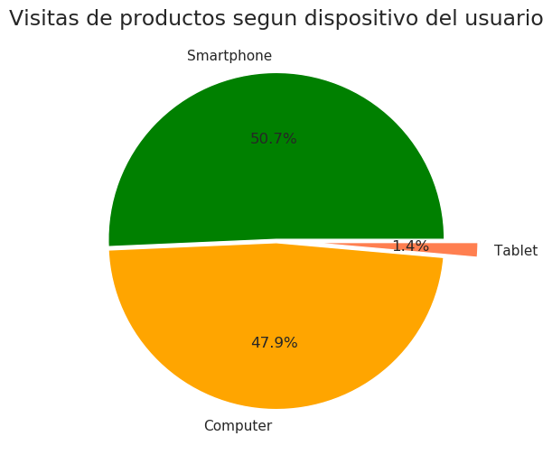


```python
#Modelos con mas checkouts
modelsData = trocafoneData[trocafoneData['model'] != 'Nan']
modelsData = modelsData[modelsData['event'] == 'checkout']
modelsPlot = modelsData['model'].value_counts().head(10).plot(kind = 'barh',figsize =(14,8));
modelsPlot.set_title('Los 10 modelos de celular con mayor chekouts', fontsize = 17, color = 'blue')
modelsPlot.set_xlabel('Numero de checkouts', color = 'blue', fontsize = 15)
modelsPlot.set_ylabel('Modelo de celular', color = 'blue', fontsize = 15);
```


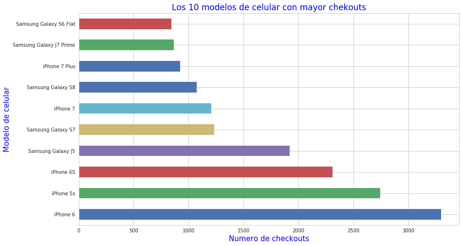


```python
#Sistemas operativos que mas se visitan
osData = trocafoneData[trocafoneData['operating_system_version'] != 'Nan']
osData = osData[osData['event'] == 'visited site']
osData = osData[osData['device_type'] == 'Smartphone']
osData_plot = osData['operating_system_version'].value_counts().head(10).plot(kind = 'barh',figsize =(14,8));
osData_plot.set_title('Los 10 OS de celulares que mas visitan el sitio', fontsize = 17, color = 'blue')
osData_plot.set_xlabel('Cantidad de vistas', color = 'blue', fontsize = 15)
osData_plot.set_ylabel('OS', color = 'blue', fontsize = 15);
```


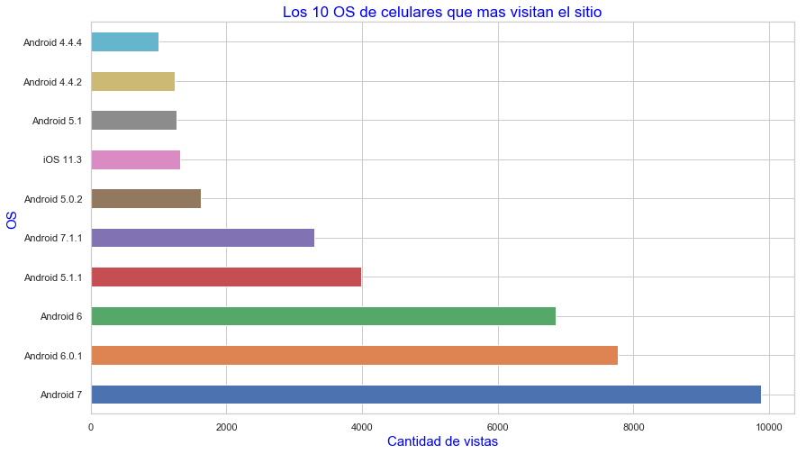


```python
#Resoluciones que mas se visitan
screen_resolution = trocafoneData[trocafoneData['screen_resolution'] != 'Nan']
screen_resolution = screen_resolution[screen_resolution['event'] == 'visited site']
screen_resolution = screen_resolution[screen_resolution['device_type'] == 'Smartphone']
screen_resolution_plot = screen_resolution['screen_resolution'].value_counts().head(10).plot(kind = 'barh', figsize =(14,8));
screen_resolution_plot.set_title('Los 10 resoluciones de celulares mas usadas en el sitio', fontsize = 17, color = 'blue')
screen_resolution_plot.set_xlabel('Cantidad de vistas', color = 'blue', fontsize = 15)
screen_resolution_plot.set_ylabel('Resolucion', color = 'blue', fontsize = 15);
```


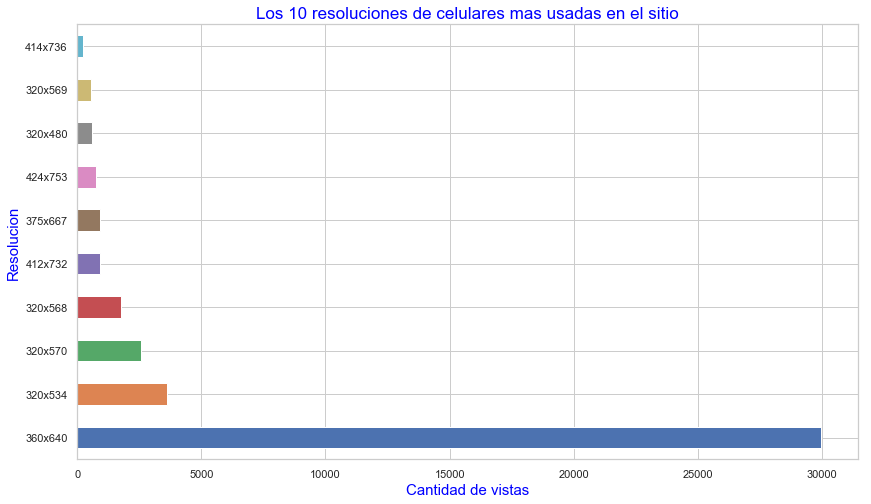


**RARO QUE LA MAS VISTA SEA UNA RESOLUCION TAN BAJA. Y EN GENERAL APARECEN TODAS MUY BAJAS**


```python
trocafoneData[trocafoneData['event'] == 'visited site']['model'].value_counts()
```


    Series([], Name: model, dtype: int64)


**QUERIA HACER UNA COMPARATIVA CON LOS MODELOS MAS VISTOS, LAS RESOLUCIONES Y LOS OS MAS VISTOS PERO NO
NO HAY DATOS DE MODELOS EN EL EVENTO 'VISITED SITE'**


```python
trocafoneData[trocafoneData['event'] != 'visited site']['operating_system_version'].value_counts()
```


    Series([], Name: operating_system_version, dtype: int64)


**SOLO HAY DATOS DE LOS OS EN EL EVENTO 'VISITED SITE'**


```python
trocafoneData[trocafoneData['event'] != 'visited site']['screen_resolution'].value_counts()
```


    Series([], Name: screen_resolution, dtype: int64)


**SOLO HAY DATOS DE RESOLUCIONES EN EL EVENTO 'VISITED SITE'**


```python
#Chequeo de elementos nulos en la columna de los eventos
trocafoneData['event'].isnull().any()
```


    False


```python
(trocafoneData['event'].value_counts()*100)/trocafoneData['event'].value_counts().sum()
```


    viewed product       52.302707
    brand listing         9.753404
    visited site          8.640269
    ad campaign hit       8.190248
    generic listing       6.678019
    searched products     5.544711
    search engine hit     5.038822
    checkout              3.335845
    staticpage            0.355784
    conversion            0.115892
    lead                  0.044300
    Name: event, dtype: float64


```python
#Grafico
#eventos = ((trocafoneData['event'].value_counts()*100)/trocafoneData['event'].value_counts().sum()).plot(figsize=(14,8), kind='barh');
eventos = np.log(trocafoneData['event'].value_counts()).plot(figsize=(14,8), kind='barh')
eventos.set_title('Ocurrencia de cada evento en el set de datos (Escala Logaritmica)',fontsize = 17, color = 'blue');
eventos.set_xlabel('Cantidad de ocurrencias (LOG)', color = 'blue', fontsize = 15);
eventos.set_ylabel('Tipo de Evento', color = 'blue', fontsize = 15);
```


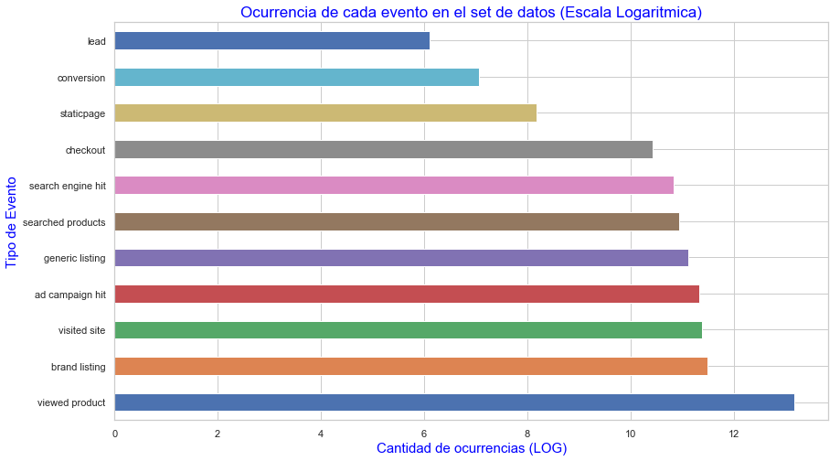


El evento predominante es "Viewed product", mas del 50% del total.


```python
#Filtro filas con sku distinto de nulo y que tengan como evento 'conversion'
views = trocafoneData[(trocafoneData['event'] == 'viewed product') & (trocafoneData['sku']!= 'NaN')]
views.head()
```


<div>
<style scoped>
    .dataframe tbody tr th:only-of-type {
        vertical-align: middle;
    }

    .dataframe tbody tr th {
        vertical-align: top;
    }

    .dataframe thead th {
        text-align: right;
    }
</style>
<table border="1" class="dataframe">
  <thead>
    <tr style="text-align: right;">
      <th></th>
      <th>timestamp</th>
      <th>event</th>
      <th>person</th>
      <th>url</th>
      <th>sku</th>
      <th>model</th>
      <th>condition</th>
      <th>storage</th>
      <th>color</th>
      <th>skus</th>
      <th>...</th>
      <th>new_vs_returning</th>
      <th>city</th>
      <th>region</th>
      <th>country</th>
      <th>device_type</th>
      <th>screen_resolution</th>
      <th>operating_system_version</th>
      <th>browser_version</th>
      <th>date</th>
      <th>time</th>
    </tr>
  </thead>
  <tbody>
    <tr>
      <th>2</th>
      <td>2018-05-31 23:38:09</td>
      <td>viewed product</td>
      <td>0004b0a2</td>
      <td>NaN</td>
      <td>2694.0</td>
      <td>iPhone 5s</td>
      <td>Bom</td>
      <td>32GB</td>
      <td>Cinza espacial</td>
      <td>NaN</td>
      <td>...</td>
      <td>NaN</td>
      <td>NaN</td>
      <td>NaN</td>
      <td>NaN</td>
      <td>NaN</td>
      <td>NaN</td>
      <td>NaN</td>
      <td>NaN</td>
      <td>2018-05-31</td>
      <td>23:38:09</td>
    </tr>
    <tr>
      <th>4</th>
      <td>2018-05-29 13:29:25</td>
      <td>viewed product</td>
      <td>0006a21a</td>
      <td>NaN</td>
      <td>15338.0</td>
      <td>Samsung Galaxy S8</td>
      <td>Bom</td>
      <td>64GB</td>
      <td>Dourado</td>
      <td>NaN</td>
      <td>...</td>
      <td>NaN</td>
      <td>NaN</td>
      <td>NaN</td>
      <td>NaN</td>
      <td>NaN</td>
      <td>NaN</td>
      <td>NaN</td>
      <td>NaN</td>
      <td>2018-05-29</td>
      <td>13:29:25</td>
    </tr>
    <tr>
      <th>13</th>
      <td>2018-04-09 20:13:14</td>
      <td>viewed product</td>
      <td>000a54b2</td>
      <td>NaN</td>
      <td>12661.0</td>
      <td>Motorola Moto Z Play</td>
      <td>Muito Bom</td>
      <td>32GB</td>
      <td>Preto</td>
      <td>NaN</td>
      <td>...</td>
      <td>NaN</td>
      <td>NaN</td>
      <td>NaN</td>
      <td>NaN</td>
      <td>NaN</td>
      <td>NaN</td>
      <td>NaN</td>
      <td>NaN</td>
      <td>2018-04-09</td>
      <td>20:13:14</td>
    </tr>
    <tr>
      <th>22</th>
      <td>2018-05-24 11:27:47</td>
      <td>viewed product</td>
      <td>000a54b2</td>
      <td>NaN</td>
      <td>10254.0</td>
      <td>iPhone 7 Plus</td>
      <td>Excelente</td>
      <td>256GB</td>
      <td>Dourado</td>
      <td>NaN</td>
      <td>...</td>
      <td>NaN</td>
      <td>NaN</td>
      <td>NaN</td>
      <td>NaN</td>
      <td>NaN</td>
      <td>NaN</td>
      <td>NaN</td>
      <td>NaN</td>
      <td>2018-05-24</td>
      <td>11:27:47</td>
    </tr>
    <tr>
      <th>26</th>
      <td>2018-05-24 11:28:59</td>
      <td>viewed product</td>
      <td>000a54b2</td>
      <td>NaN</td>
      <td>6581.0</td>
      <td>iPhone 6S</td>
      <td>Bom</td>
      <td>16GB</td>
      <td>Cinza espacial</td>
      <td>NaN</td>
      <td>...</td>
      <td>NaN</td>
      <td>NaN</td>
      <td>NaN</td>
      <td>NaN</td>
      <td>NaN</td>
      <td>NaN</td>
      <td>NaN</td>
      <td>NaN</td>
      <td>2018-05-24</td>
      <td>11:28:59</td>
    </tr>
  </tbody>
</table>
<p>5 rows × 25 columns</p>
</div>


```python
conv_plot = views['model'].value_counts().head(10).plot(figsize=(14,8), kind='barh')
conv_plot.set_title('10 productos con mayor cantidad de visitas', fontsize = 20, color = 'blue');
conv_plot.set_xlabel('Numero de visitas', color = 'blue', fontsize = 18);
conv_plot.set_ylabel('Modelo del producto', color = 'blue', fontsize = 18);
```


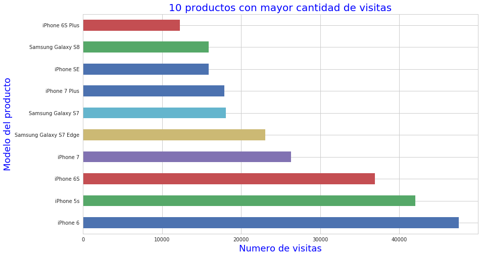


```python
#Filtro filas con sku distinto de nulo y que tengan como evento 'conversion'
conversions = trocafoneData[(trocafoneData['event'] == 'conversion') & (trocafoneData['sku']!= 'NaN')]
conversions.head()
```


<div>
<style scoped>
    .dataframe tbody tr th:only-of-type {
        vertical-align: middle;
    }

    .dataframe tbody tr th {
        vertical-align: top;
    }

    .dataframe thead th {
        text-align: right;
    }
</style>
<table border="1" class="dataframe">
  <thead>
    <tr style="text-align: right;">
      <th></th>
      <th>timestamp</th>
      <th>event</th>
      <th>person</th>
      <th>url</th>
      <th>sku</th>
      <th>model</th>
      <th>condition</th>
      <th>storage</th>
      <th>color</th>
      <th>skus</th>
      <th>...</th>
      <th>new_vs_returning</th>
      <th>city</th>
      <th>region</th>
      <th>country</th>
      <th>device_type</th>
      <th>screen_resolution</th>
      <th>operating_system_version</th>
      <th>browser_version</th>
      <th>date</th>
      <th>time</th>
    </tr>
  </thead>
  <tbody>
    <tr>
      <th>220</th>
      <td>2018-03-20 17:46:12</td>
      <td>conversion</td>
      <td>00204059</td>
      <td>NaN</td>
      <td>3084.0</td>
      <td>Motorola Moto X2</td>
      <td>Muito Bom</td>
      <td>32GB</td>
      <td>Couro Vintage</td>
      <td>NaN</td>
      <td>...</td>
      <td>NaN</td>
      <td>NaN</td>
      <td>NaN</td>
      <td>NaN</td>
      <td>NaN</td>
      <td>NaN</td>
      <td>NaN</td>
      <td>NaN</td>
      <td>2018-03-20</td>
      <td>17:46:12</td>
    </tr>
    <tr>
      <th>2282</th>
      <td>2018-04-26 22:28:53</td>
      <td>conversion</td>
      <td>00c13dee</td>
      <td>NaN</td>
      <td>6650.0</td>
      <td>Samsung Galaxy Core Plus Duos TV</td>
      <td>Muito Bom</td>
      <td>4GB</td>
      <td>Branco</td>
      <td>NaN</td>
      <td>...</td>
      <td>NaN</td>
      <td>NaN</td>
      <td>NaN</td>
      <td>NaN</td>
      <td>NaN</td>
      <td>NaN</td>
      <td>NaN</td>
      <td>NaN</td>
      <td>2018-04-26</td>
      <td>22:28:53</td>
    </tr>
    <tr>
      <th>2547</th>
      <td>2018-06-10 14:37:50</td>
      <td>conversion</td>
      <td>00fdbb4b</td>
      <td>NaN</td>
      <td>3348.0</td>
      <td>Samsung Galaxy S6 Flat</td>
      <td>Muito Bom</td>
      <td>32GB</td>
      <td>Branco</td>
      <td>NaN</td>
      <td>...</td>
      <td>NaN</td>
      <td>NaN</td>
      <td>NaN</td>
      <td>NaN</td>
      <td>NaN</td>
      <td>NaN</td>
      <td>NaN</td>
      <td>NaN</td>
      <td>2018-06-10</td>
      <td>14:37:50</td>
    </tr>
    <tr>
      <th>4245</th>
      <td>2018-03-16 13:50:25</td>
      <td>conversion</td>
      <td>0146a9df</td>
      <td>NaN</td>
      <td>2694.0</td>
      <td>iPhone 5s</td>
      <td>Bom</td>
      <td>32GB</td>
      <td>Cinza espacial</td>
      <td>NaN</td>
      <td>...</td>
      <td>NaN</td>
      <td>NaN</td>
      <td>NaN</td>
      <td>NaN</td>
      <td>NaN</td>
      <td>NaN</td>
      <td>NaN</td>
      <td>NaN</td>
      <td>2018-03-16</td>
      <td>13:50:25</td>
    </tr>
    <tr>
      <th>6985</th>
      <td>2018-02-09 22:07:07</td>
      <td>conversion</td>
      <td>01db2fe6</td>
      <td>NaN</td>
      <td>6357.0</td>
      <td>Samsung Galaxy J5</td>
      <td>Bom</td>
      <td>16GB</td>
      <td>Preto</td>
      <td>NaN</td>
      <td>...</td>
      <td>NaN</td>
      <td>NaN</td>
      <td>NaN</td>
      <td>NaN</td>
      <td>NaN</td>
      <td>NaN</td>
      <td>NaN</td>
      <td>NaN</td>
      <td>2018-02-09</td>
      <td>22:07:07</td>
    </tr>
  </tbody>
</table>
<p>5 rows × 25 columns</p>
</div>


```python
conv_plot = conversions['model'].value_counts().head(5).plot(figsize=(14,8), kind='barh')
conv_plot.set_title('5 Productos con mayor cantidad de conversiones (Compras)', fontsize = 15, color = 'blue');
conv_plot.set_xlabel('Numero de conversiones', color = 'blue', fontsize = 13);
conv_plot.set_ylabel('Modelo del producto', color = 'blue', fontsize = 13);
```


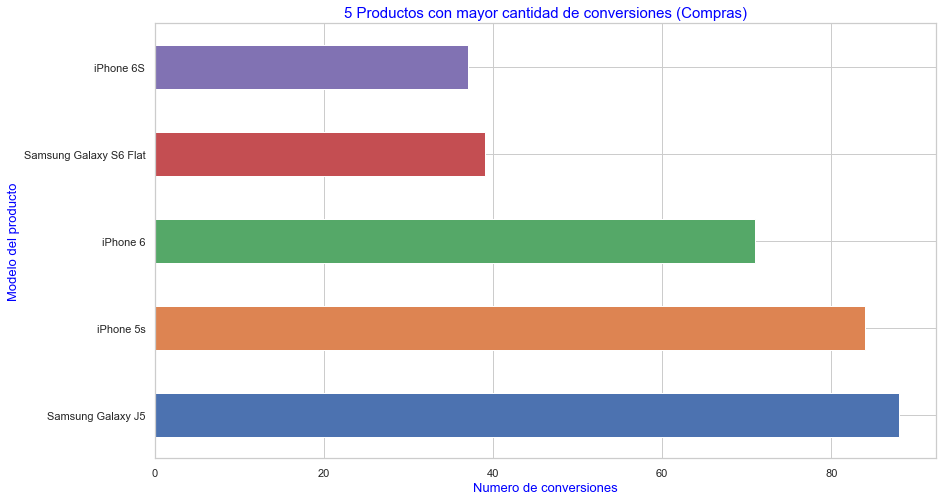


```python
data_location = trocafoneData
data_location = data_location[data_location['city'].notnull()]
data_location = data_location[data_location['city']!='Unknown']
personas = data_location.groupby('person').first().reset_index()
location_personas = personas[['person','city','region','country']]
```


```python
conversion_citys = pd.merge(conversions,location_personas,left_on='person',right_on='person',how='inner').drop(columns=['city_x', 'region_x','country_x']).rename(columns={'city_y': 'city', 'region_y': 'region', 'country_y': 'country'})
```


```python
conversion_by_region = conversion_citys.groupby(['model','region']).size().unstack(fill_value=0)
conversion_by_region = conversion_by_region.loc[(conversion_by_region>5).any(1), (conversion_by_region>5).any(0)]
```


```python
plt.figure(figsize = (20,10))
conversion_by_region_heatMap = sbn.heatmap(conversion_by_region,vmin=0,vmax=40, cmap='BuPu', linewidths=0.5,annot=True )
conversion_by_region_heatMap.set_ylabel("Modelo", fontsize = 20)
conversion_by_region_heatMap.set_xlabel("Región", fontsize = 20)
conversion_by_region_heatMap.set_title("Modelos de Celular por Region", fontsize = 35)
conversion_by_region_heatMap.tick_params(axis='both', labelsize=15)
conversion_by_region_heatMap.set_xticklabels(labels = conversion_by_region.columns.values, rotation=-20);
```


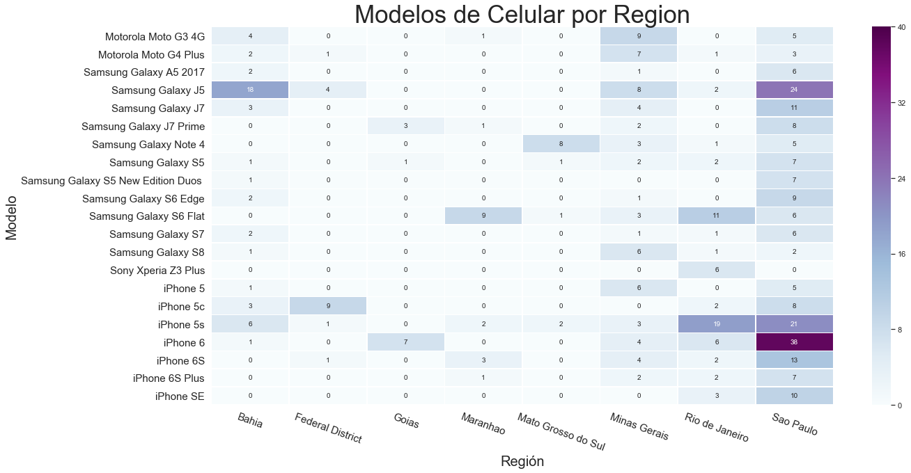


```python
trocafoneData['event'].drop_duplicates()
```


    0         ad campaign hit
    1            visited site
    2          viewed product
    3                checkout
    8         generic listing
    10      search engine hit
    12          brand listing
    157     searched products
    220            conversion
    254            staticpage
    3248                 lead
    Name: event, dtype: object


```python
df=trocafoneData
```


```python
df[df['event'] == 'checkout'].head(1)
```


<div>
<style scoped>
    .dataframe tbody tr th:only-of-type {
        vertical-align: middle;
    }

    .dataframe tbody tr th {
        vertical-align: top;
    }

    .dataframe thead th {
        text-align: right;
    }
</style>
<table border="1" class="dataframe">
  <thead>
    <tr style="text-align: right;">
      <th></th>
      <th>timestamp</th>
      <th>event</th>
      <th>person</th>
      <th>url</th>
      <th>sku</th>
      <th>model</th>
      <th>condition</th>
      <th>storage</th>
      <th>color</th>
      <th>skus</th>
      <th>...</th>
      <th>new_vs_returning</th>
      <th>city</th>
      <th>region</th>
      <th>country</th>
      <th>device_type</th>
      <th>screen_resolution</th>
      <th>operating_system_version</th>
      <th>browser_version</th>
      <th>date</th>
      <th>time</th>
    </tr>
  </thead>
  <tbody>
    <tr>
      <th>3</th>
      <td>2018-05-31 23:38:40</td>
      <td>checkout</td>
      <td>0004b0a2</td>
      <td>NaN</td>
      <td>2694.0</td>
      <td>iPhone 5s</td>
      <td>Bom</td>
      <td>32GB</td>
      <td>Cinza espacial</td>
      <td>NaN</td>
      <td>...</td>
      <td>NaN</td>
      <td>NaN</td>
      <td>NaN</td>
      <td>NaN</td>
      <td>NaN</td>
      <td>NaN</td>
      <td>NaN</td>
      <td>NaN</td>
      <td>2018-05-31</td>
      <td>23:38:40</td>
    </tr>
  </tbody>
</table>
<p>1 rows × 25 columns</p>
</div>


```python
df[df['event'] == 'conversion'].head()
```


<div>
<style scoped>
    .dataframe tbody tr th:only-of-type {
        vertical-align: middle;
    }

    .dataframe tbody tr th {
        vertical-align: top;
    }

    .dataframe thead th {
        text-align: right;
    }
</style>
<table border="1" class="dataframe">
  <thead>
    <tr style="text-align: right;">
      <th></th>
      <th>timestamp</th>
      <th>event</th>
      <th>person</th>
      <th>url</th>
      <th>sku</th>
      <th>model</th>
      <th>condition</th>
      <th>storage</th>
      <th>color</th>
      <th>skus</th>
      <th>...</th>
      <th>new_vs_returning</th>
      <th>city</th>
      <th>region</th>
      <th>country</th>
      <th>device_type</th>
      <th>screen_resolution</th>
      <th>operating_system_version</th>
      <th>browser_version</th>
      <th>date</th>
      <th>time</th>
    </tr>
  </thead>
  <tbody>
    <tr>
      <th>220</th>
      <td>2018-03-20 17:46:12</td>
      <td>conversion</td>
      <td>00204059</td>
      <td>NaN</td>
      <td>3084.0</td>
      <td>Motorola Moto X2</td>
      <td>Muito Bom</td>
      <td>32GB</td>
      <td>Couro Vintage</td>
      <td>NaN</td>
      <td>...</td>
      <td>NaN</td>
      <td>NaN</td>
      <td>NaN</td>
      <td>NaN</td>
      <td>NaN</td>
      <td>NaN</td>
      <td>NaN</td>
      <td>NaN</td>
      <td>2018-03-20</td>
      <td>17:46:12</td>
    </tr>
    <tr>
      <th>2282</th>
      <td>2018-04-26 22:28:53</td>
      <td>conversion</td>
      <td>00c13dee</td>
      <td>NaN</td>
      <td>6650.0</td>
      <td>Samsung Galaxy Core Plus Duos TV</td>
      <td>Muito Bom</td>
      <td>4GB</td>
      <td>Branco</td>
      <td>NaN</td>
      <td>...</td>
      <td>NaN</td>
      <td>NaN</td>
      <td>NaN</td>
      <td>NaN</td>
      <td>NaN</td>
      <td>NaN</td>
      <td>NaN</td>
      <td>NaN</td>
      <td>2018-04-26</td>
      <td>22:28:53</td>
    </tr>
    <tr>
      <th>2547</th>
      <td>2018-06-10 14:37:50</td>
      <td>conversion</td>
      <td>00fdbb4b</td>
      <td>NaN</td>
      <td>3348.0</td>
      <td>Samsung Galaxy S6 Flat</td>
      <td>Muito Bom</td>
      <td>32GB</td>
      <td>Branco</td>
      <td>NaN</td>
      <td>...</td>
      <td>NaN</td>
      <td>NaN</td>
      <td>NaN</td>
      <td>NaN</td>
      <td>NaN</td>
      <td>NaN</td>
      <td>NaN</td>
      <td>NaN</td>
      <td>2018-06-10</td>
      <td>14:37:50</td>
    </tr>
    <tr>
      <th>4245</th>
      <td>2018-03-16 13:50:25</td>
      <td>conversion</td>
      <td>0146a9df</td>
      <td>NaN</td>
      <td>2694.0</td>
      <td>iPhone 5s</td>
      <td>Bom</td>
      <td>32GB</td>
      <td>Cinza espacial</td>
      <td>NaN</td>
      <td>...</td>
      <td>NaN</td>
      <td>NaN</td>
      <td>NaN</td>
      <td>NaN</td>
      <td>NaN</td>
      <td>NaN</td>
      <td>NaN</td>
      <td>NaN</td>
      <td>2018-03-16</td>
      <td>13:50:25</td>
    </tr>
    <tr>
      <th>6985</th>
      <td>2018-02-09 22:07:07</td>
      <td>conversion</td>
      <td>01db2fe6</td>
      <td>NaN</td>
      <td>6357.0</td>
      <td>Samsung Galaxy J5</td>
      <td>Bom</td>
      <td>16GB</td>
      <td>Preto</td>
      <td>NaN</td>
      <td>...</td>
      <td>NaN</td>
      <td>NaN</td>
      <td>NaN</td>
      <td>NaN</td>
      <td>NaN</td>
      <td>NaN</td>
      <td>NaN</td>
      <td>NaN</td>
      <td>2018-02-09</td>
      <td>22:07:07</td>
    </tr>
  </tbody>
</table>
<p>5 rows × 25 columns</p>
</div>


```python
conv_plot = np.log(conversions['condition'].value_counts()).plot(figsize=(14,8), kind='bar')
conv_plot.set_title('Cantidad de conversiones segun condicion (Escala Logaritmica)', fontsize = 20, color = 'blue');
conv_plot.set_xlabel('Numero de conversiones (LOG)', color = 'blue', fontsize = 18);
conv_plot.set_ylabel('Condicion del producto', color = 'blue', fontsize = 18);
```


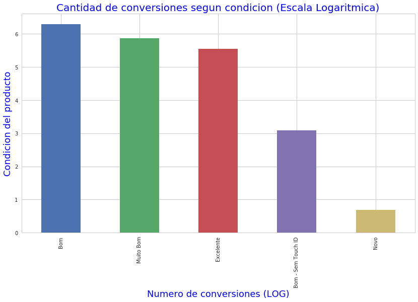


## Estudio segun los usuarios


```python
#Chequeo de elementos nulos en la columna de los usuarios
trocafoneData['person'].isnull().any()
```


    False


```python
trocafoneData['person'].value_counts().head(10)
```


    71492f2b    2771
    6b07be7b    2770
    285101a1    2140
    3e34b3cf    1877
    2d5a84c1    1800
    5f25cb5d    1797
    5af7e2bc    1773
    3b5a5833    1705
    d7e60792    1352
    cd6e0b8d    1254
    Name: person, dtype: int64


```python
#Los 10 usuarios con mayor actividad en la plataforma
users = (trocafoneData['person'].value_counts().head(10)).plot(figsize=(14,8), kind='barh');
users.set_title('Los 10 usuarios con mayor actividad en la plataforma',fontsize = 20, color = 'blue');
users.set_xlabel('Numero de interacciones en la plataforma', color = 'blue', fontsize = 18);
users.set_ylabel('Codigo de usuario', color = 'blue', fontsize = 18);
```


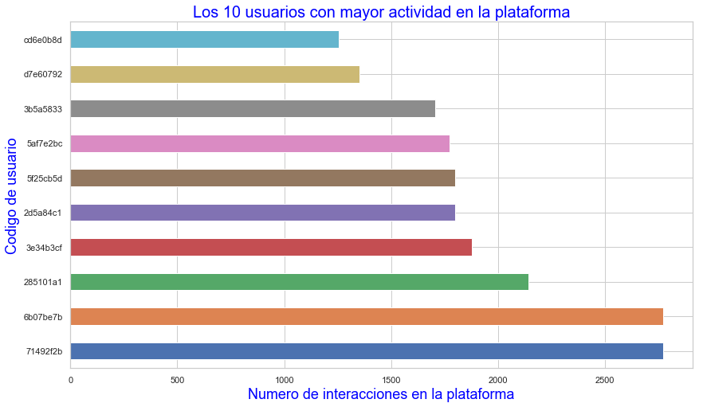


## Estudio segun dias y meses


```python
#Distribucion de la actidad del sitio segun el mes
monthPlot = pd.to_datetime(trocafoneData['date']).dt.month.hist(figsize = (14,8),bins = 6, edgecolor = 'black');
monthPlot.set_title('Distribucion de la actividad del sitio segun el mes', fontsize = 20, color = 'green')
monthPlot.set_xlabel('Mes', color = 'green', fontsize = 18)
monthPlot.set_ylabel('Actividad', color = 'green', fontsize = 18);
```


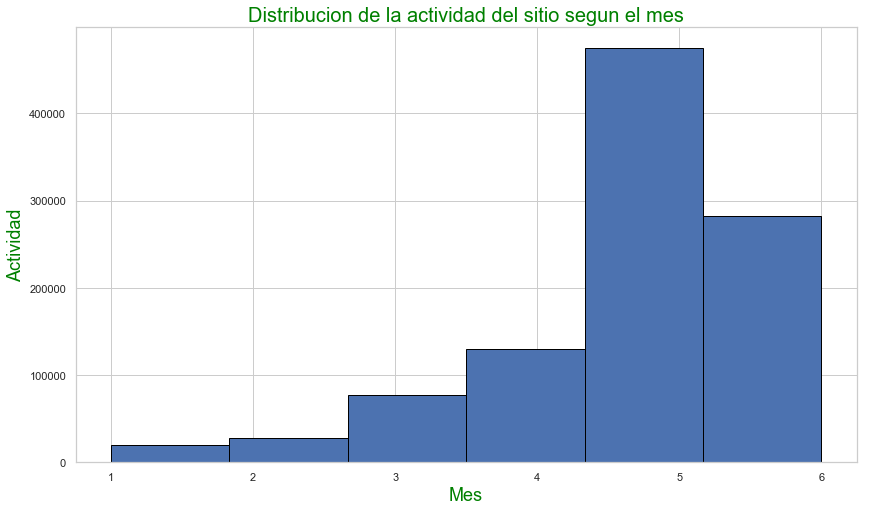


```python
#Distribucion de la actidad del sitio segun el dia de la semana
fig = plt.figure()
daysPlot = fig.add_subplot(111)
plt.title('Distribucion de la actividad del sitio segun el dia del mes', fontsize = 20, color = 'green')

daysPlot.set_xlabel('Dia', color = 'green', fontsize = 14)

pd.to_datetime(trocafoneData['date']).dt.day.hist(figsize=(14,8), bins = 31, edgecolor = 'black')

daysPlot.set_ylabel('Recuento de actividad', color = 'green', fontsize = 14)
daysPlot.set_xlim(1, 31 )
daysPlot.set_xticks(range(1, 31, 1))
plt.show()
```


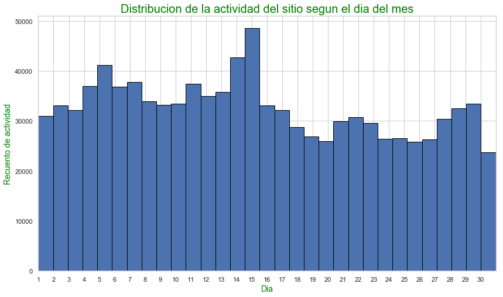


```python
#Distribucion de la actidad del sitio segun la hora del dia
hoursPlot = pd.to_datetime(trocafoneData['timestamp']).dt.hour.hist(figsize=(14,8), bins = 24, edgecolor = 'black')
hoursPlot.set_title('Distribucion de la actividad en el sitio segun la hora del dia',fontsize = 20, color = 'green')
hoursPlot.set_xlabel('Hora del dia (formato 24hs)', fontsize = 18 , color = 'green')
hoursPlot.set_ylabel('Actividad en el sitio', fontsize = 18 , color = 'green')
hoursPlot.set_xlim(0, 23 )
hoursPlot.set_xticks(range(0, 23, 1));
```


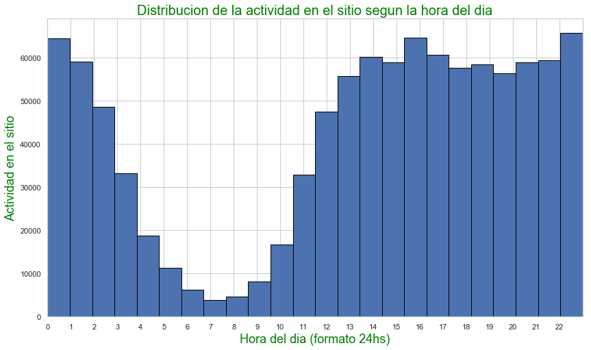


## Estudio segun los paises


```python
country_visitSite = trocafoneData[trocafoneData['event'] == 'visited site']
country_visitSite = country_visitSite[country_visitSite['country'] != 'Unknown']
plt.title('Distribucion de los 10 paises que mas visitan la pagina (Escala Logaritmica)', fontsize = 17, color ='Blue')
plt.xlabel('Cantidad de visitas (LOG)',fontsize = 15, color = 'Blue')
plt.ylabel('Pais',fontsize = 15, color = 'Blue')
np.log(country_visitSite['country'].value_counts()).head(10).plot(figsize = (10,8), kind='barh');
```


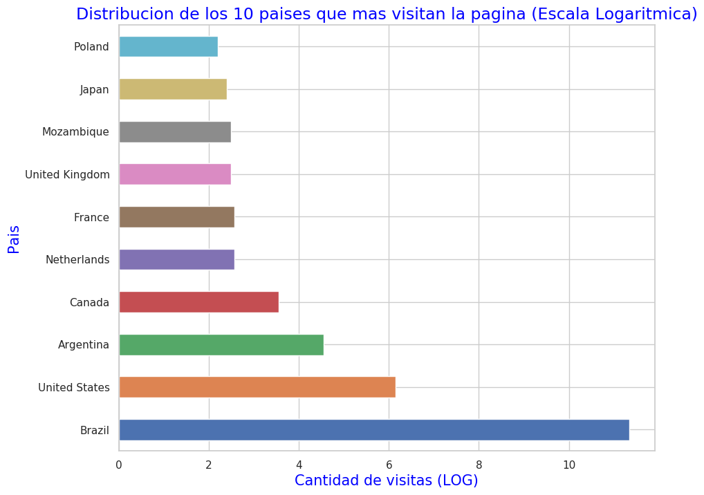


```python
country_visitSite = trocafoneData[trocafoneData['event'] == 'visited site']
country_visitSite = country_visitSite[country_visitSite['country'] != 'Unknown']
country_visitSite.replace({'country': {"United Kingdom": "UK", "United States": "US","South Africa": "South_Africa",
                                       "Saudi Arabia" : "Saudi_Arabia","Sri Lanka":"Sri_Lanka","Cape Verde" : "Cape_Verde",
                                      "Dominican Republic" : "Dominican_Republic", "French Guiana" : "French_Guiana "}},  
                                      inplace = True)
countries = country_visitSite['country'].value_counts()

wordcloud = WordCloud(background_color='white',mode = 'RGBA',margin = 5).generate(str(countries))

plt.imshow(wordcloud, interpolation="bilinear")
plt.axis('off')
plt.title('Word Cloud de paises que mas visitan la pagina \n', fontsize=18, color = 'black');
plt.show()


```


```python
trocafoneData['event'].value_counts()
```


    viewed product       528931
    brand listing         98635
    visited site          87378
    ad campaign hit       82827
    generic listing       67534
    searched products     56073
    search engine hit     50957
    checkout              33735
    staticpage             3598
    conversion             1172
    lead                    448
    Name: event, dtype: int64


```python
checkout = trocafoneData[trocafoneData['event'] == 'checkout']
checkout['country'].value_counts()
```


    Series([], Name: country, dtype: int64)


No hay datos de paises para el evento 'checkout'


```python
viewed_product = trocafoneData[trocafoneData['event'] == 'viewed product']
viewed_product['country'].value_counts()
```


    Series([], Name: country, dtype: int64)


No hay datos de paises para el evento 'viewed product'


```python
searched_products = trocafoneData[trocafoneData['event'] == 'searched products']
searched_products['country'].value_counts()
```


    Series([], Name: country, dtype: int64)


No hay datos de paises para el evento 'searched products'


```python
conversion = trocafoneData[trocafoneData['event'] == 'conversion']
conversion['country'].value_counts()
```


    Series([], Name: country, dtype: int64)


No hay datos de paises para el evento 'conversion'


```python
trocafoneData[trocafoneData['event'] != 'visited site']['country'].value_counts()
```


    Series([], Name: country, dtype: int64)


**NO HAY DATOS DE PAISES EN NINGUN EVENTO QUE NO SEA 'VISITED SITE'**


```python
trocafoneData[trocafoneData['model'] != 'NaN']['country'].value_counts()
```


    Brazil                84308
    Unknown                2313
    United States           465
    Argentina                94
    Canada                   35
    Netherlands              13
    France                   13
    United Kingdom           12
    Mozambique               12
    Japan                    11
    Poland                    9
    French Guiana             8
    Portugal                  7
    Romania                   7
    Italy                     7
    Dominican Republic        6
    Russia                    6
    Guadeloupe                6
    Germany                   5
    Bangladesh                4
    Paraguay                  4
    Colombia                  4
    Switzerland               3
    India                     2
    Angola                    2
    Morocco                   2
    Sri Lanka                 1
    Philippines               1
    Algeria                   1
    China                     1
    South Africa              1
    Spain                     1
    Rwanda                    1
    Mexico                    1
    Israel                    1
    Cape Verde                1
    Saudi Arabia              1
    Belize                    1
    Peru                      1
    Uzbekistan                1
    Venezuela                 1
    Ireland                   1
    Turkey                    1
    Denmark                   1
    Zimbabwe                  1
    Uruguay                   1
    Name: country, dtype: int64


